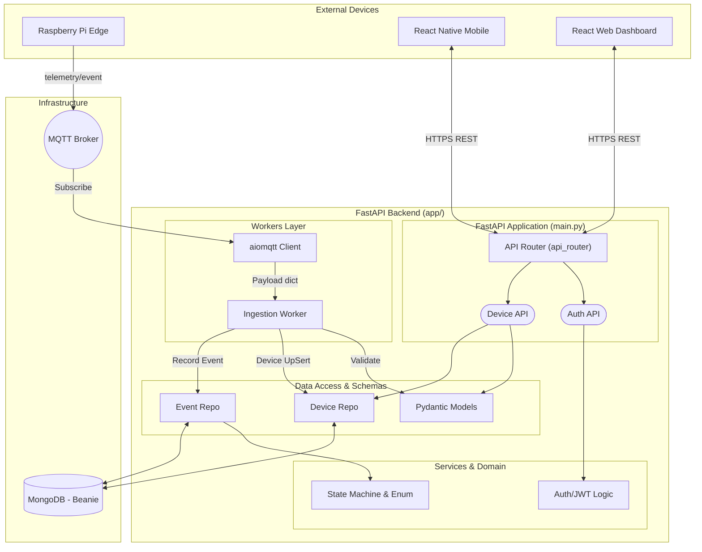
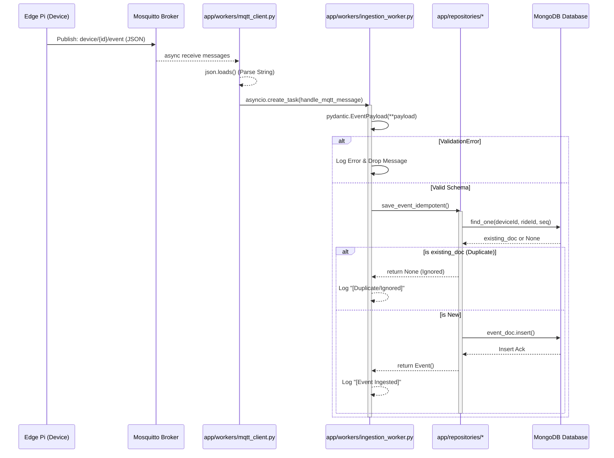
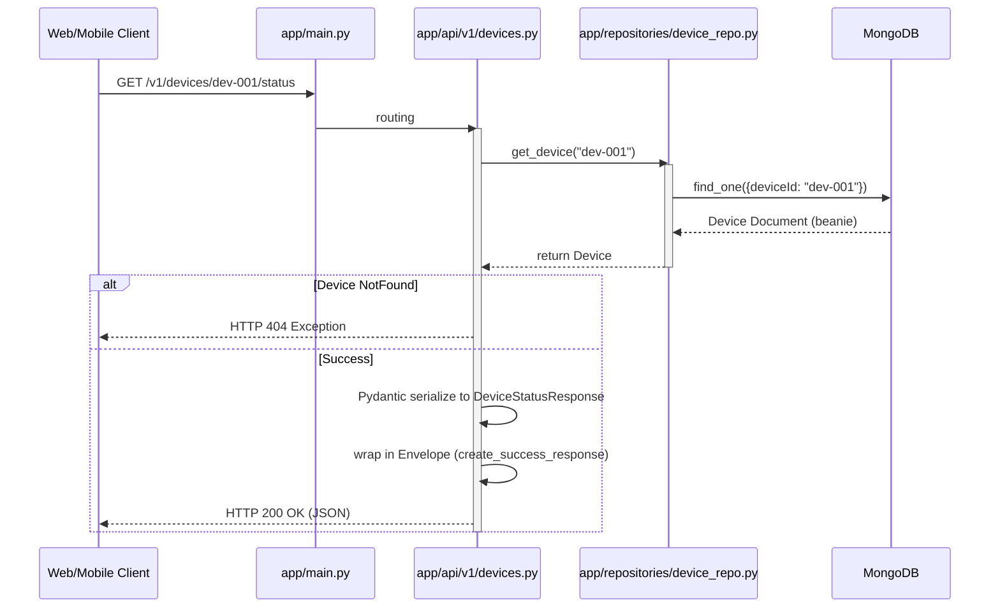

# 백엔드 초기 코드 분석 및 시스템 다이어그램

본 문서는 현재까지 개발된 FastAPI 백엔드(M1, M2) 코드가 제공된 개발 지침(AGENTS.md, IMPLEMENTATION_PLAN)을 얼마나 잘 따랐는지 평가하고, 발견된 취약점 및 개선점과 함께 시스템의 세부 작동 다이어그램을 제공합니다. (2026-04-17-03:07)

---

## 1. 지침 준수율 및 코드 평가

### ✅ 지침을 완벽히 준수한 부분 (Strengths)
1. **역할(Layer) 분리 원칙**: API 엔드포인트(`api/`), DB CRUD(`repositories/`), MQTT 비동기 로직(`workers/`), 비즈니스 구조(`domain/`, `schemas/`) 분리 원칙을 충실히 반영했습니다.
2. **멱등성(Idempotence) 보장**: `backend/app/repositories/models.py`에서 `deviceId` + `rideId` + `seq` 속성에 복합 고유 인덱스를 구성하여, 중복 MQTT 이벤트 수신 시 데이터 무결성을 보장하도록 설계되었습니다.
3. **Pydantic 스키마 필수 적용**: 모든 입출력 및 MQTT 페이로드 분석에 Pydantic v2 모델을 활용하여, 페이로드 타입 검증(`ValidationError`)이 실패할 시 안전하게 인제스천 처리를 무시하도록 구현했습니다.
4. **비동기 기본(Async-first)**: `asyncio`, `aiomqtt`, `motor`, `beanie` 등 전체 스택을 비동기로 구성하여 FastAPI의 퍼포먼스를 해치지 않습니다.

### ⚠️ 미달 및 개선 필요 사항 (Weaknesses)
1. **상태 기계(State Machine) 검증 부재**: `domain/states.py`에 전이 매트릭스(`ALLOWED_TRANSITIONS`)를 구현했으나, `ingestion_worker.py`의 `process_event`에서 데이터 유효성을 검증할 때 이 로직을 아직 주입하지 않았습니다. (현재 무조건 `anomaly=False`로 처리 중)
2. **요약/버킷 저장 미적용**: 원시 텔레메트리(`TelemetryPayload`)가 1Hz로 폭주할 경우를 대비한 분/시 단위 `telemetry_buckets` 저장 로직이 아직 비어있습니다. 현재 상태는 `device의 lastSeenAt`만 갱신하며 버리고 있습니다.

---

## 2. 보안 취약점 및 버그 분석

> [!CAUTION]
> 작성된 코드는 초기 파이프라인(M1/M2) 설정을 위한 MVP 코드로, 프로덕션 환경에 배포하기 전에 반드시 아래의 보안 결함을 수정해야 합니다.

1. **하드코딩된 인증 정보 (Hardcoded Secrets)**:
   - `auth.py`의 `login` 함수 내부에서 `credentials.password == "admin"`을 통해 하드코딩된 패스워드를 사용하고 있습니다. 
   - 반환되는 토큰 역시 `"mock-jwt-token"`으로 가짜 토큰을 발급 중입니다. JWT 라이브러리를 활용해 서명된 토큰을 발급하고 검증하는 로직 보완이 필요합니다.
2. **REST API 권한 검사 (Authorization) 누락**:
   - `v1/devices.py`의 내 엔드포인트들에 역할(Role)이나 토큰을 검증하는 `Depends(get_current_user)`와 같은 의존성이 현재 없습니다. 이로 인해 임의의 사용자가 악의적으로 기기를 등록하거나 조회할 수 있습니다.
3. **MQTT SSL/TLS 통신 부재**:
   - `mqtt_client.py`에서 클라이언트가 로컬 호스트로 연결할 때 평문 연결(1883 포트)을 시도합니다. 프로덕션에서는 MQTTS(8883) 방식 및 TLS 인증 환경 세팅이 적용되어야 합니다.
4. **전역 예외 처리 로직 (Catch-All Exception)**:
   - `ingestion_worker.py` 내 `handle_mqtt_message` 함수에서 `except Exception as e:`를 통해 모든 에러를 흡수하고 있습니다. 이는 런타임 오류가 잠재적으로 무시되어 데이터 누락을 유발할 수 있으므로 구체적인 Error 분류 로깅이 필요합니다.

---

## 3. 백엔드 시스템 다이어그램 (Mermaid)

시스템의 전체 데이터 흐름과 레이어별 책임 구조를 매우 상세하게 도식화했습니다.

### 3.1 전체 구조 및 레이어 (Architecture Diagram)

### 3.2 MQTT 인제스천 시퀀스 (Sequential Flow)

MQTT 워커가 이벤트를 수신하여 DB에 멱등성 있게 저장하는 과정을 상세히 나열한 다이어그램입니다.

### 3.3 HTTP REST 요청 시퀀스 (기기 상태 조회 시)

